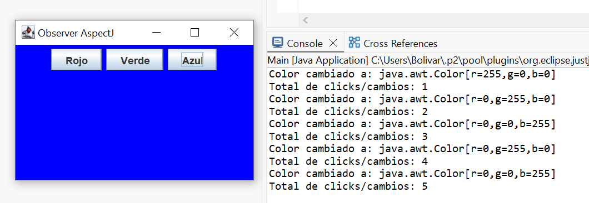

# Descripcion de la funcionalidad agregada 

Al hacer clic en cada botón de color, el programa cambia el color de fondo de la ventana y muestra en la consola el nuevo color seleccionado.

Además, se implementó una funcionalidad adicional utilizando AspectJ:
cada vez que se hace clic en un botón, se incrementa un contador que registra la cantidad total de cambios de color.

